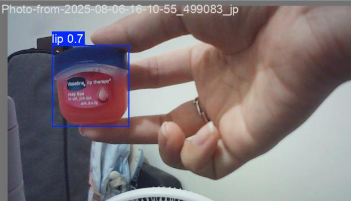

# YOLO Lip Detection & Tracking Model

## 📋 Overview

This repository contains a custom-trained YOLO model specifically designed for real-time lip detection and tracking. The model achieves high accuracy in detecting lips in various conditions and can be used for applications such as lip-reading systems, facial feature analysis, or augmented reality filters.

## 🎯 Model Performance

### Key Metrics
- **Precision**: ~100% on validation set
- **Recall**: ~100% on validation set
- **mAP@50**: ~100%
- **mAP@50-95**: ~100%
- **Confidence Threshold**: 0.7-0.8

### Training Results

The model was trained for 130 epochs with the following characteristics:

#### Loss Convergence
- **Box Loss**: Converged from ~0.8 to ~0.25
- **Classification Loss**: Dropped from ~3.5 to ~0.6
- **DFL Loss**: Reduced from ~1.1 to ~0.8

#### Performance Metrics Evolution
- Precision and Recall reached near-perfect scores after ~50 epochs
- mAP scores stabilized at maximum values, indicating excellent detection performance
- Validation losses showed consistent improvement throughout training


## 🔍 Model Capabilities

### Detection Examples

The model successfully detects lips with high confidence scores (0.7-0.8) in various scenarios:

| Test Case | Confidence Score | Description |
|-----------|-----------------|-------------|
| Close-up Detection | 0.7 | Accurate lip detection in close-range shots |
| Variable Backgrounds | 0.8 | Robust detection against complex backgrounds |




## 📊 Confusion Matrix Analysis

The confusion matrix demonstrates the model's classification performance:


- **True Positives**: 2 (100% detection rate for lip class)
- **False Positives**: 0
- **False Negatives**: 0
- **Background**: Correctly identified as non-lip regions

The model shows perfect classification between lip and background classes with no misclassifications.


## 📁 Project Structure

```
YOLO model/
├── models/
│   ├── best.pt              # Best performing model weights
├── data/
│   ├── train/               # Training images
│   ├── val/                 # Validation images
├── results/
│   ├── confusion_matrix.png # Confusion matrix
│   ├── results.png          # Training curves
│   └── predictions/         # Sample predictions
└── README.md
```

## 🔧 Training Configuration
### Training Parameters

```bash
!yolo train model=yolov8n.pt data=/content/datasets/mecanum_0806-2/data.yaml epochs=130 batch=16 imgsz=640
```

## 📈 Model Architecture

- **Base Model**: YOLOv8 (customized for single-class detection)
- **Input Size**: 640x480
- **Classes**: 1 (lip)
- **Output**: Bounding box coordinates with confidence scores


## 📄 License

This project is licensed under the MIT License - see the [LICENSE](LICENSE) file for details.

## 🙏 Acknowledgments

- YOLOv8 by Ultralytics
- OpenCV community
- Contributors and testers
